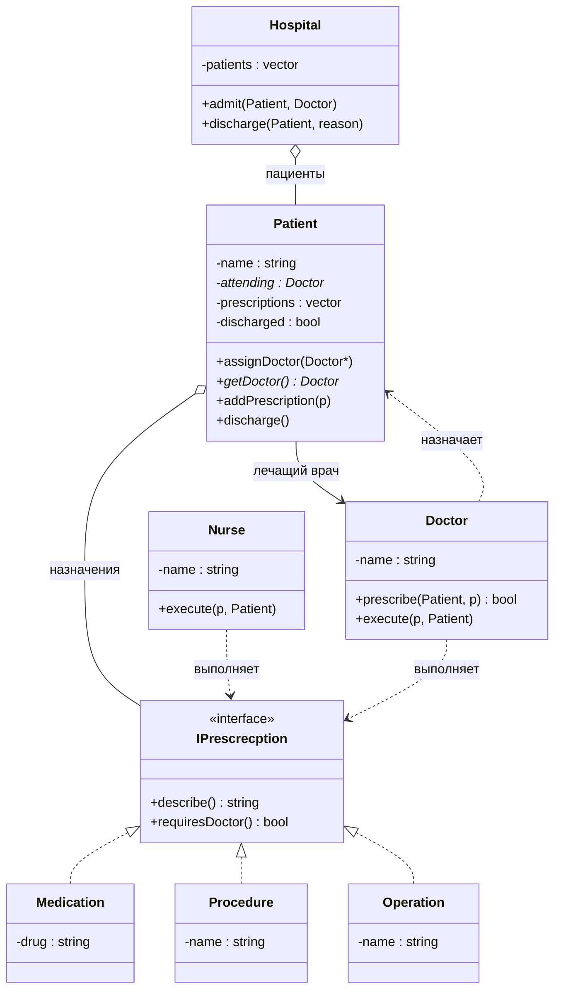
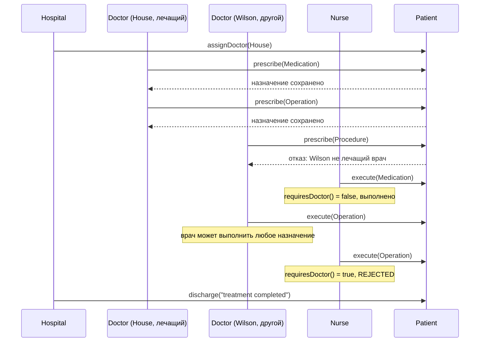

**Тема:** разработка программ с использованием принципа единственной обязанности (SRP) и принципа открытости/закрытости (OCP)
**Язык:** C++17
 
Три учебные системы, реализованные в одном файле `lab1.cpp`. Каждая показывает, как SRP и OCP применяются на практике: обязанности разделены между классами, а расширение достигается через интерфейсы, без правки существующего кода.

- [1. Система «Платежи»](#1-система-платежи)
- [2. Система «Факультатив»](#2-система-факультатив)
- [3. Система «Больница»](#3-система-больница)
---
 
Какая система запускается, выбирается в `main()`: раскомментируй нужный тест.
 
```cpp
int main() {
    //testPaymentSystem();
    //testOptionalCourseSystem();
    testHospitalSystem();
}
```
 
---
 
## 1. Система «Платежи»
 
Клиент платит за заказ, переводит деньги между счетами. Администратор может заблокировать кредитную карту.
 
**Сущности:** `Client`, `BankAccount`, `CreditCard`, `Order`, `Administrator`.
 
**OCP.** Платёж описан двумя интерфейсами: `IPaymentSource` (откуда списываем) и `IPaymentDestination` (куда зачисляем). Метод `Client::transferMoney` работает только с ними, поэтому новый способ оплаты добавляется отдельным классом, а `Client` не меняется.
 
| Класс | Источник | Получатель |
|-------|:--------:|:----------:|
| `BankAccount` | ✅ | ✅ |
| `CreditCard` | ✅ | ❌ |
| `Order` | ❌ | ✅ |
 
**SRP.** `CreditCard` отвечает за лимит и блокировку, `BankAccount` за баланс, `Order` за факт оплаты, `Client` за инициацию платежа, `Administrator` за блокировку карты.
 
---
 
## 2. Система «Факультатив»
 
Преподаватель выставляет оценки студентам, записанным на курс, оценки сохраняются в архив.
 
**Сущности:** `Student`, `Course`, `Teacher`, `IGradeStorage` и его реализация `LocalArchive`.
 
**OCP.** `Teacher` получает ссылку на интерфейс `IGradeStorage`, а не на конкретный архив. Чтобы хранить оценки в файле или базе данных, достаточно написать новый класс-наследник `IGradeStorage`, а `Teacher` менять не нужно.
 
**SRP.** `Course` ведёт список записанных студентов и сам проверяет повторную запись, `LocalArchive` хранит оценки в виде `курс → студент → оценка`, `Teacher` проверяет, что студент записан на курс, и выставляет оценку.
 
---
 
## 3. Система «Больница»
 
### Задание
 
Пациенту назначается лечащий врач. Врач может сделать пациенту назначение (процедуры, лекарства, операции). Медсестра или другой врач выполняют назначение. Пациент может быть выписан из больницы по окончании лечения, при нарушении режима или по иным обстоятельствам.
 
### Сущности и обязанности
 
| Класс | Обязанность (единственная причина для изменения) |
|-------|--------------------------------------------------|
| `IPrescrecption` | Интерфейс назначения: описание и признак «требует врача» |
| `Medication`, `Procedure`, `Operation` | Конкретные виды назначений |
| `Patient` | Данные пациента: имя, лечащий врач, список назначений, статус выписки |
| `Doctor` | Назначает (только как лечащий врач) и выполняет назначения |
| `Nurse` | Выполняет назначения, не требующие врача |
| `Hospital` | Принимает пациентов и выписывает их с указанием причины |
 
### Диаграмма классов
 

 
### Диаграмма последовательности
 
Сценарий: приём пациента, назначения, выполнение, выписка.
 

 
### Как реализован SRP
 
- **Данные отделены от действий.** `Patient` только хранит состояние и не знает, как назначения выполняются.
- **Назначение отделено от выполнения.** `Doctor::prescribe` добавляет назначение в карту пациента, `execute` у `Doctor` и `Nurse` его исполняет. Эти обязанности можно менять независимо.
- **Больница управляет потоком пациентов.** `Hospital` принимает и выписывает, но не знает ни о видах назначений, ни о том, кто их выполняет.
- **Каждый вид назначения знает только о себе.** `Medication`, `Procedure` и `Operation` отвечают за собственное описание и признак `requiresDoctor()`.
### Как реализован OCP
 
Назначения могут пополняться (в задании это прямо сказано), поэтому они вынесены в интерфейс:
 
```cpp
class IPrescrecption {
public:
    virtual std::string describe() const = 0;
    virtual bool requiresDoctor() const = 0;  // медсестра не делает операции
    virtual ~IPrescrecption() = default;
};
```
 
`Patient` хранит `std::shared_ptr<IPrescrecption>`, `Doctor` и `Nurse` принимают `const IPrescrecption&`. Ни один из этих классов не знает, какие именно виды назначений существуют.
 
**Чтобы добавить новый вид назначения, например физиотерапию, достаточно одного нового класса:**
 
```cpp
class Physiotherapy : public IPrescrecption {
    std::string name;
public:
    Physiotherapy(std::string n) : name(n) {}
    std::string describe() const override { return "Physiotherapy: " + name; }
    bool requiresDoctor() const override { return false; }
};
```
 
`Patient`, `Doctor`, `Nurse` и `Hospital` при этом не меняются.
 
Ограничение «операцию может сделать только врач» тоже задано в самом назначении через `requiresDoctor()`. Поэтому `Nurse` не проверяет тип назначения через `if`/`dynamic_cast`. Новое «врачебное» назначение получит нужное поведение автоматически.
 
Причина выписки передаётся строкой (`"treatment completed"`, `"regime violation"` и т. д.), поэтому новые причины не требуют изменения кода.
 
### Бизнес-правила
 
- Назначение может сделать только **лечащий врач** пациента, иначе врач получает отказ.
- Выполнить назначение может **любой врач**, а также **медсестра**, если назначение не требует врача.
- Медсестра **не может** выполнять операции: для них `requiresDoctor()` возвращает `true`.
### Тестовый сценарий
 
Функция `testHospitalSystem()`:
 
```cpp
hospital.admit(patient, house);
 
house.prescribe(patient, std::make_shared<Medication>("Aspirin"));
house.prescribe(patient, std::make_shared<Operation>("Appendectomy"));
wilson.prescribe(patient, std::make_shared<Procedure>("Massage"));  // не лечащий -> отказ
 
nurse.execute(*patient.getPrescriptions()[0], patient);   // лекарство: ок
wilson.execute(*patient.getPrescriptions()[1], patient);  // операция: врач выполняет
nurse.execute(*patient.getPrescriptions()[1], patient);   // операция: медсестра отклоняет
 
hospital.discharge(patient, "treatment completed");
```
 
Ожидаемый вывод:
 
```text
[Hospital] admitted Ivan
[Doctor House] prescribed to Ivan: Medication: Aspirin
[Doctor House] prescribed to Ivan: OPeration: Appendectomy
[Doctor Wilson] not attending doctor of Ivan
[Nurse Anna] Ivan <- Medication: Aspirin
[Doctor Wilson] Ivan <- OPeration: Appendectomy
[Nurse Anna] REJECTED: Ivan <- OPeration: Appendectomy (Requires Doctor!)
[Hospital] Ivan discharged: treatment completed
```
 
Что проверяет сценарий:
 
| Проверка | Строка вывода |
|----------|---------------|
| Приём и назначение лечащим врачом | `[Doctor House] prescribed ...` |
| Назначать может только лечащий врач | `[Doctor Wilson] not attending doctor ...` |
| Медсестра выполняет обычное назначение | `[Nurse Anna] Ivan <- Medication ...` |
| Другой врач выполняет операцию | `[Doctor Wilson] Ivan <- OPeration ...` |
| Медсестра не может выполнять операции | `[Nurse Anna] REJECTED ...` |
| Выписка с причиной | `[Hospital] Ivan discharged ...` |